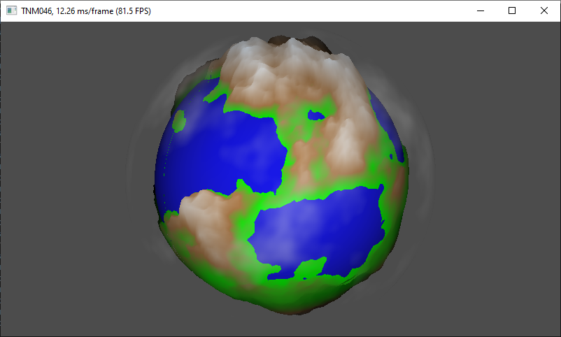

# TNM084-project
Procedural project for the course TNM084 at Linköping University. 

## Nuget Pakages:
glfw
Opentribe.gl
Opentribe.gl.Winforms

## Sources:
[github.com/ashima/webgl-noise](http://github.com/ashima/webgl-noise)
[gist.github.com/patriciogonzalezvivo/670c22f3966e662d2f83](https://gist.github.com/patriciogonzalezvivo/670c22f3966e662d2f83)
 